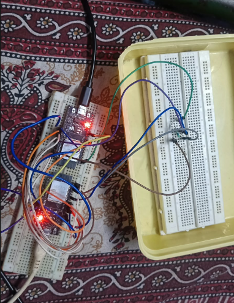
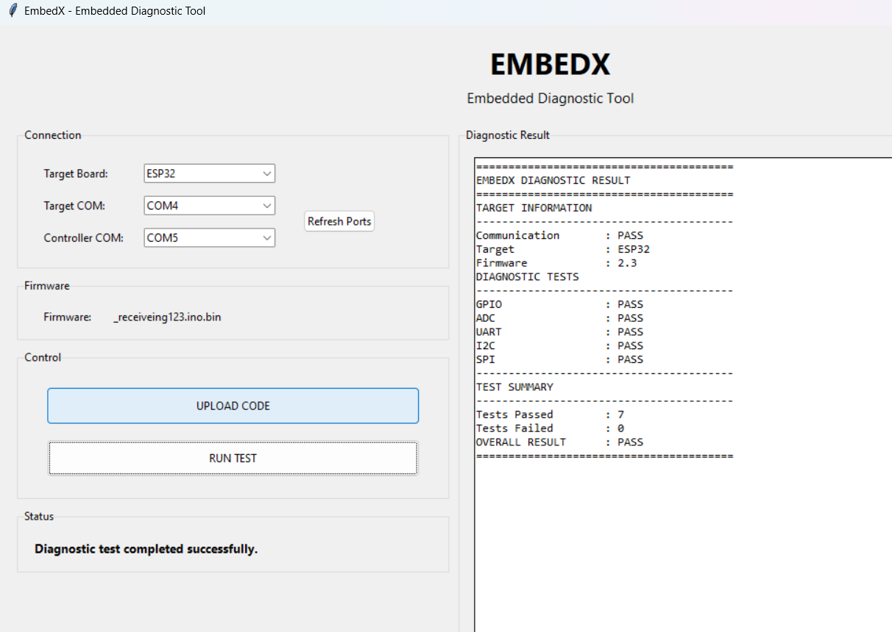

# EmbedX

## Automated Embedded Board Programming and Diagnostic Platform

EmbedX is an embedded-board programming and diagnostic platform that combines automated firmware programming, embedded hardware-interface diagnostics, and unified result reporting into a single workflow.

The current working prototype uses an ESP32 as the EmbedX controller and another ESP32 as the target board. A Python/Tkinter PC application handles target programming, diagnostic execution, and result visualization.

---

## Overview

EmbedX is designed to reduce repetitive manual procedures involved in embedded-board programming and validation.

The current prototype provides:

- Automated target firmware programming
- ESP32-based diagnostic controller
- Target-board diagnostic firmware
- GPIO diagnostics
- ADC diagnostics
- UART diagnostics
- I2C diagnostics
- SPI diagnostics
- Unified PASS/FAIL reporting
- PC-based graphical interface

The basic workflow is:

**Program → Diagnose → Collect Results → Report**

---

## Problem Statement

Embedded-board testing commonly involves separate programming and testing procedures.

Typical challenges include:

- Manual firmware programming
- Separate procedures for different hardware interfaces
- Repetitive diagnostic operations
- Manual interpretation of test results
- Lack of a unified diagnostic report
- Time-consuming board validation

EmbedX addresses these challenges by combining programming and diagnostic testing into a structured automated workflow.

---

## Proposed Solution

EmbedX consists of three major parts:

1. **PC Application** – provides the user interface and automates target firmware programming.
2. **EmbedX Controller** – executes the diagnostic sequence and communicates with the target.
3. **Target Board** – runs dedicated diagnostic firmware and performs the requested tests.

The system follows this architecture:

```text
                    PC / EmbedX GUI
                     /           \
                    /             \
           PROGRAMMING         DIAGNOSTICS
          Python + esptool          |
                  |                 |
                  v                 v
            Target ESP32     EmbedX Controller
                  ^                 |
                  |                 |
                  +---- Diagnostics+
                       Commands/Results
```

### Key Architecture

**PC programs the target → Controller diagnoses the target → PC displays the result**

---

## System Workflow

```text
Start EmbedX
      |
      v
Select Target and Controller COM Ports
      |
      v
Select Target Firmware
      |
      v
Upload Code
      |
      v
Python + esptool Programs Target
      |
      v
Run Test
      |
      v
EmbedX Controller Executes Diagnostics
      |
      +---- GPIO
      |
      +---- ADC
      |
      +---- UART
      |
      +---- I2C
      |
      +---- SPI
      |
      v
Collect Results
      |
      v
Generate Unified Diagnostic Report
      |
      v
PASS / FAIL
```

---

## Hardware

The current prototype uses two ESP32 development boards.

### EmbedX Controller

The controller is responsible for:

- Receiving commands from the PC
- Communicating with the target
- Executing diagnostic tests
- Processing diagnostic results
- Generating the unified diagnostic report

### Target ESP32

The target board is the device being programmed and diagnosed.

It runs dedicated EmbedX target diagnostic firmware.

## Hardware Prototype



---

## Diagnostic Interfaces

### GPIO

The current GPIO diagnostic uses a dedicated output-to-input connection on the target board.

```text
Target GPIO26 -------- Target GPIO27
       OUT                   IN
```

The target generates a digital signal and verifies the corresponding input.

### ADC

The current ADC diagnostic uses the controller DAC output as the test stimulus.

```text
Controller GPIO25 (DAC)
          |
          v
Target GPIO34 (ADC)
```

The target samples the ADC input and returns the measured value.

The controller compares the measured value with predefined reference values using an acceptable tolerance.

### UART

The controller and target use a dedicated UART connection.

```text
Controller GPIO17 (TX) ----> Target GPIO16 (RX)

Controller GPIO16 (RX) <---- Target GPIO17 (TX)

Controller GND ------------- Target GND
```

The controller sends a predefined test message and verifies the response returned by the target.

### I2C

The current I2C configuration uses:

```text
SDA : GPIO21
SCL : GPIO22
```

Connection:

```text
Controller GPIO21 -------- Target GPIO21
Controller GPIO22 -------- Target GPIO22
Controller GND ----------- Target GND
```

Two 4.7 kOhm pull-up resistors are used for SDA and SCL.

### SPI

The current SPI configuration is:

```text
Target GPIO18  -------- Controller GPIO18
Target GPIO23  -------- Controller GPIO23
Target GPIO19  -------- Controller GPIO19
Target GPIO5   -------- Controller GPIO5
Target GND     -------- Controller GND
```

The signals are:

```text
SCLK : GPIO18
MOSI : GPIO23
MISO : GPIO19
CS   : GPIO5
```

The target operates as the SPI master and the EmbedX controller operates as the SPI slave.

The target sends a predefined test sequence and verifies the response from the controller.

---

## Software Architecture

EmbedX consists of three major software components.

### 1. Controller Firmware

Runs on the EmbedX controller ESP32.

Responsibilities:

- Receive commands from the PC
- Communicate with the target
- Execute the diagnostic sequence
- Process diagnostic results
- Generate unified PASS/FAIL status

### 2. Target Diagnostic Firmware

Runs on the target ESP32.

Responsibilities:

- Respond to diagnostic commands
- Perform GPIO testing
- Perform ADC measurements
- Perform UART testing
- Perform I2C testing
- Perform SPI testing
- Return diagnostic responses

### 3. PC Application

The PC application is developed using Python and Tkinter.

Responsibilities:

- Select target COM port
- Select controller COM port
- Select firmware
- Program the target
- Start diagnostics
- Receive diagnostic output
- Extract the final diagnostic result
- Display the unified report

---

## PC Application

The EmbedX GUI provides:

- Target board selection
- Target COM port selection
- Controller COM port selection
- Firmware selection
- Upload Code control
- Run Test control
- Status display
- Unified diagnostic result display

The GUI uses a two-column layout:

```text
+----------------------+-----------------------------+
|       CONTROLS       |     DIAGNOSTIC RESULT       |
|                      |                             |
| Target Board         | Communication : PASS       |
| Target COM           | Target        : ESP32      |
| Controller COM       | Firmware      : 2.3        |
| Firmware             |                             |
|                      | GPIO          : PASS       |
| [ UPLOAD CODE ]      | ADC           : PASS       |
|                      | UART          : PASS       |
| [ RUN TEST ]         | I2C           : PASS       |
|                      | SPI           : PASS       |
| Status               |                             |
|                      | Overall       : PASS       |
+----------------------+-----------------------------+
```

## Diagnostic Result



---

## Automated Firmware Programming

Target firmware programming is automated using Python and `esptool`.

The programming flow is:

```text
PC / Python
     |
     v
esptool
     |
     v
Target ESP32
     |
     v
Target Diagnostic Firmware
```

The programmer:

1. Checks the required firmware files.
2. Connects to the selected target COM port.
3. Erases the target flash.
4. Writes the bootloader.
5. Writes the partition table.
6. Writes the boot application.
7. Writes the target firmware.
8. Reports programming status.

---

## Diagnostic Process

When **RUN TEST** is selected, the PC application sends the run command to the EmbedX controller.

The controller executes the complete diagnostic sequence.

The current sequence includes:

```text
PING
  |
  v
IDENTIFY
  |
  v
GPIO TEST
  |
  v
ADC TEST
  |
  v
UART TEST
  |
  v
I2C TEST
  |
  v
SPI TEST
  |
  v
UNIFIED RESULT
```

Each diagnostic test produces a PASS or FAIL status.

---

## Unified Diagnostic Report

The controller combines the individual test results into one report.

Example:

```text
========================================
          EMBEDX DIAGNOSTIC RESULT
========================================

TARGET INFORMATION
----------------------------------------
Communication       : PASS
Target              : ESP32
Firmware            : 2.3

DIAGNOSTIC TESTS
----------------------------------------
GPIO                : PASS
ADC                 : PASS
UART                : PASS
I2C                 : PASS
SPI                 : PASS

----------------------------------------
TEST SUMMARY
----------------------------------------
Tests Passed        : 7
Tests Failed        : 0

OVERALL RESULT      : PASS
========================================
```

The unified report provides:

- Target communication status
- Target identification
- Firmware version
- Individual diagnostic results
- Number of tests passed
- Number of tests failed
- Overall PASS/FAIL status

---

## Communication

### PC to Controller

The PC communicates with the EmbedX controller through USB serial communication.

### Controller to Target

The controller communicates with the target through the configured diagnostic interfaces.

Current runtime interfaces include:

- UART
- I2C
- SPI

The diagnostic firmware uses predefined commands and responses to coordinate testing.

---


## Requirements

### Hardware

- ESP32 development board x2
- USB cables x2
- Jumper wires
- 4.7 kOhm resistors x2

### Software

- Windows PC
- Arduino IDE
- Python 3.x
- esptool
- Tkinter
- ESP32 Arduino board support package

---

## Python Setup

Check the Python installation:

```cmd
python --version
```

Check esptool:

```cmd
python -m esptool version
```

Check available serial ports:

```cmd
python -m serial.tools.list_ports
```

---

## Running the System

### Step 1 - Connect the Boards

Connect the EmbedX controller and target ESP32 to the PC.

Connect the required diagnostic wiring between the controller and target.

### Step 2 - Start the GUI

Run:

```cmd
python embedx_gui.py
```

### Step 3 - Select Communication Ports

Select:

```text
Target COM Port
Controller COM Port
```

COM port numbers may vary between systems.

### Step 4 - Select Firmware

Select the target firmware image that should be programmed.

### Step 5 - Upload Code

Click:

```text
UPLOAD CODE
```

The PC application programs the target using `esptool`.

### Step 6 - Run Test

After successful programming, click:

```text
RUN TEST
```

The EmbedX controller executes the diagnostic sequence.

### Step 7 - View Result

The final unified diagnostic report is displayed in the GUI.

---

## Technology Stack

| Category | Technology |
|---|---|
| Controller | ESP32 |
| Target | ESP32 |
| Firmware | Embedded C/C++ |
| Framework | Arduino |
| PC Application | Python |
| GUI | Tkinter |
| Programming | esptool |
| GPIO Testing | ESP32 GPIO |
| ADC Testing | ESP32 ADC |
| UART Testing | HardwareSerial |
| I2C Testing | Wire |
| SPI Testing | ESP32 SPI |
| PC Communication | USB Serial |

---

## Current Prototype

The current prototype demonstrates an end-to-end working workflow:

```text
PC GUI
  |
  +-- Automated Firmware Programming
  |
  v
Target ESP32
  |
  v
EmbedX Controller
  |
  +-- GPIO Diagnostic
  +-- ADC Diagnostic
  +-- UART Diagnostic
  +-- I2C Diagnostic
  +-- SPI Diagnostic
  |
  v
Unified Diagnostic Result
  |
  v
PC GUI
```

The working prototype demonstrates:

- Automated target firmware programming
- ESP32 controller-target communication
- GPIO diagnostics
- ADC diagnostics
- UART diagnostics
- I2C diagnostics
- SPI diagnostics
- Diagnostic result processing
- Unified PASS/FAIL reporting
- PC-based graphical interface

---

## Limitations

The current implementation is an ESP32-based prototype.

The target diagnostic firmware and pin configuration are currently designed for the validated ESP32 target configuration.

The system does not automatically support every microcontroller or development board.

Different target boards may require:

- Target-specific diagnostic firmware
- Different programming tools
- Different pin mappings
- Different peripheral configurations
- Different communication methods

Complete physical/electrical fault coverage may require a dedicated hardware test fixture and additional measurement circuitry.

---

## Future Scope

### Multi-Board Support

Future versions can support:

- ESP32 variants
- Arduino boards
- Other microcontroller development boards
- Board-specific diagnostic profiles

### Target Profiles

Each supported board can have a profile containing:

```text
Target Profile
|
+-- Pin Mapping
+-- Peripheral Availability
+-- Diagnostic Configuration
+-- Firmware Image
+-- Programming Method
```

### Automatic Port Detection

Future versions can automatically detect available boards and simplify COM-port selection.

### Hardware Test Fixture

A dedicated fixture or adapter can reduce manual wiring.

Possible implementations include:

- Board-specific adapters
- Pogo-pin fixtures
- Connector-based test interfaces
- Reusable diagnostic docks

### Diagnostic History

Future versions can store:

- Test results
- Board identification
- Firmware version
- Test time
- PASS/FAIL history
- Diagnostic reports

### Industrial Validation

The platform can potentially be extended toward:

- Embedded laboratory testing
- Development-board testing
- Prototype validation
- Hardware debugging
- Industrial embedded-system validation

---

## Applications

Potential applications include:

- Embedded systems laboratories
- Electronics education
- Development-board validation
- Prototype testing
- Embedded firmware development
- Hardware debugging
- Board-level diagnostic testing
- Industrial embedded-system validation

---

## Project Status

**Working Prototype**

Current validated diagnostic interfaces:

```text
GPIO  - PASS
ADC   - PASS
UART  - PASS
I2C   - PASS
SPI   - PASS
```

The complete prototype demonstrates:

```text
Automated Programming
        +
Embedded Diagnostics
        +
Result Processing
        +
PC Visualization
```

---

## Future Product Direction

The long-term direction of EmbedX is to evolve from the current single-board prototype into a modular embedded-board validation platform.

```text
ESP32 Prototype
       |
       v
Target Profiles
       |
       v
Multi-Board Support
       |
       v
Automatic Configuration
       |
       v
Diagnostic Fixture
       |
       v
Lab / Industrial Validation Platform
```

---

## Author

**EmbedX Project**

An embedded systems project focused on automated board programming, diagnostic testing, communication, and result visualization.

---

## License

This project is intended for educational, research, and development purposes.

License terms can be updated as the project evolves.
